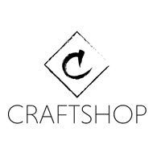

# CraftShop

## [See the App!](https://craftshop-ih.netlify.app/)

## Description

CraftShop is a web designed for a single seller to post all their products with the option fro other people to make a user and comment on the products and buy them

#### [Client Repo here](https://github.com/r-ruizfer/CraftShop-frontend)

#### [Server Repo here](https://github.com/r-ruizfer/CraftShop-Backend)

## Technologies & Libraries used

CSS, React, JavaScript, Bootstrap, Cloudinary, Strpie, Passport

## Backlog Functionalities

Upvote/Downvote system, report system, Delivery...

# Client Structure

## User Stories

**NOTE -** List here all the actions a user can do in the app. Example:

- **404** - As a user I want to see a nice 404 page when I go to a page that doesn’t exist so that I know it was my fault
- **500** - As a user I want to see a nice error page when the super team screws it up so that I know that is not my fault
- **homepage** - As a user I want to be able to access the homepage so that I see all the products available and filter them by category
- **sign up** - As a user I want to sign up on the webpage so that I can wishlist items, add them to my cart and pay for them
- **login** - As a user I want to be able to log in on the webpage so that I can get back to my account
- **logout** - As a user I want to be able to log out from the webpage so that I can make sure no one will access my account
- **product details** - As a user I want to see all the details of a product before I buy it, such as what kind of product it is, how much it costs, a short description, a purchase button to buy that item and also a comment box to say what I think about it or reccomend it.
- **wishlist** - As a user I want to wishlist items i want to buy in the ffuture for easier access
- **cart** - As a user I want to add items to my cart so I dont have to pay individually for them
- **searchbar/search results** - As a user I want tobe able to type a key word to be able to see if any product matches what im looking for and then see all the products that match my query
- **Profile** - As a user I want to have a Profile page with my details for easier purchasing of my products (send address, first name, last name) and I can set up a profile picture so that i will be easily recognized when I comment on a product

## Client Routes

**NOTE -** Use below table to list your frontend routes

## React Router Routes (React App)

| Path                  | Page            | Components                                                     | Permissions                        | Behavior                                                      |
| --------------------- | --------------- | -------------------------------------------------------------- | ---------------------------------- | ------------------------------------------------------------- |
| `/`                   | Product list    |                                                                | public                             | Shows all Products                                            |
| `/signup`             | Signup          |                                                                | not logged in only `<!IsLoggedIn>` | Signup form, link to login, navigate to homepage after signup |
| `/login`              | Login           |                                                                | not logged in only `<!IsLoggedIn>` | Login form, link to signup, navigate to homepage after login  |
| `/profile`            | Profile         | EditProfile                                                    | user only `<IsLoggedIn>`           | review account details, edit them                             |
| `/product/:productId` | Product details | Comment Box, Add to Wishlist/cart, Purchase, see more Products | public                             | Shows Product Details                                         |
| `/wishlist`           | WishList        | smallProductCard                                               | user only `<IsLoggedIn>`           | Shows all products on Wishlist                                |
| `/cart`               | Cart            | Cart                                                           | user only `<IsLoggedIn>`           | Shows all products in Cart                                    |
| `/error`              | Error500        |                                                                | Public                             | Shows an error 500 message                                    |
| `*`                   | ErrorPage       |                                                                | Public                             | Shows an error 404message                                     |

## Other Components

- Navbar
- Footer
- add/edit product form
- edit user form

## Services

- Auth Service

  - auth.login(user)
  - auth.signup(user)
  - auth.verify()

- Backlog Service
  - product.filter(title, category)
  - product.detail(id)
  - product.add(id)
  - product.delete(id)
  - product.update(id)

## Context

- auth.context
- cart.context
- wishlist.context
- product.context
- comments.context

## Links

### Collaborators

[Developer 1 name](https://github.com/anruiz-r)

[Developer 2 name](https://github.com/r-ruizfer)

### Project

[Repository Link Client](https://github.com/r-ruizfer/CraftShop-frontend)

[Repository Link Server](https://github.com/r-ruizfer/CraftShop-Backend)

[Deploy Link](https://craftshop-ih.netlify.app/)

### Slides

[Slides Link](www.your-slides-url-here.com)
